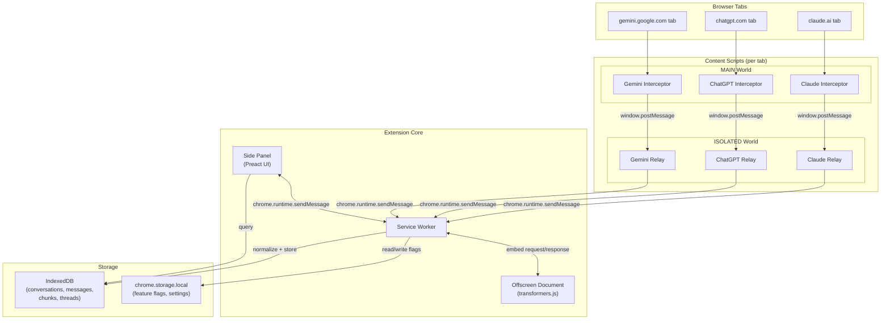
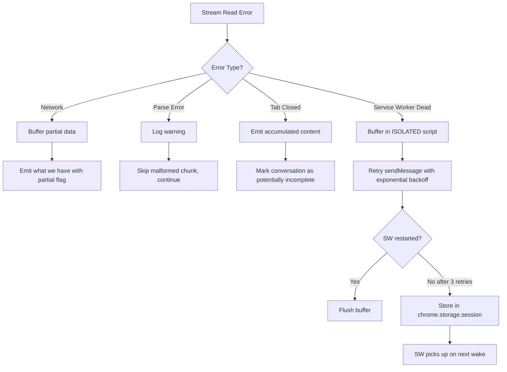
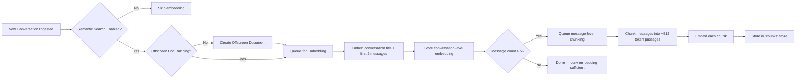
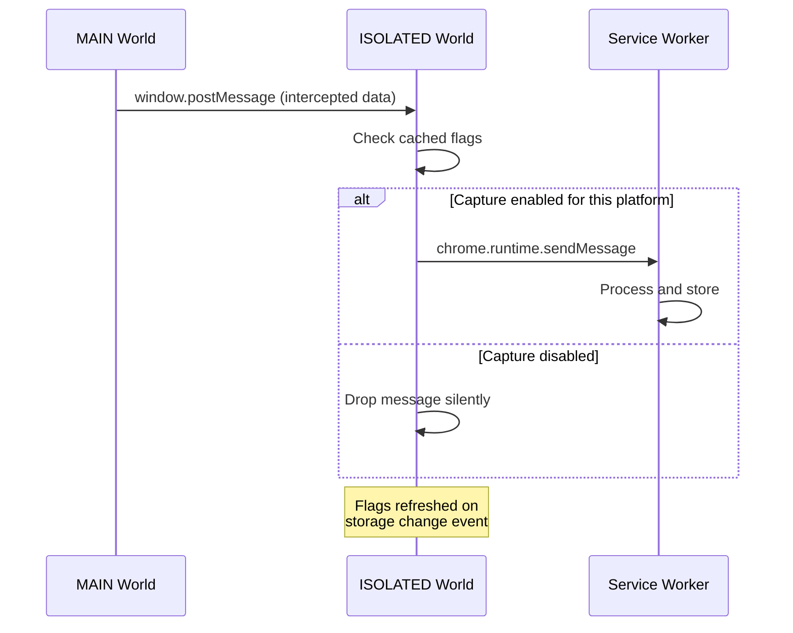
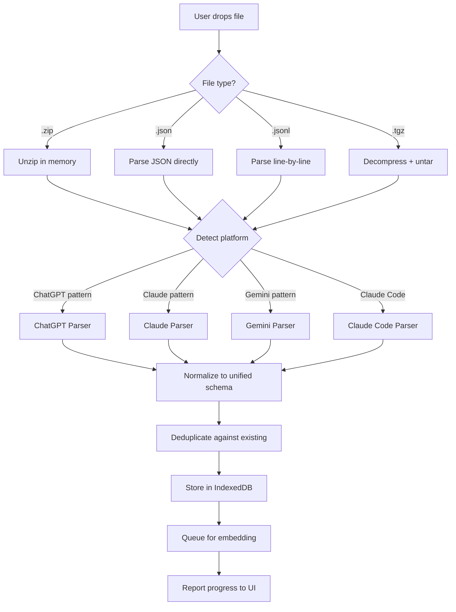

# ChatRecall — System Architecture

## Table of Contents
1. [Data Model](#1-data-model)
2. [Extension Architecture](#2-extension-architecture)
3. [Live Capture Pipeline](#3-live-capture-pipeline)
4. [LRU-Cache Layer](#4-lru-cache-layer)
5. [Semantic Search Pipeline](#5-semantic-search-pipeline)
6. [Chain-of-Thought Detection](#6-chain-of-thought-detection)
7. [Feature Flag System](#7-feature-flag-system)
8. [Import/Export Pipeline](#8-importexport-pipeline)

---

## 1. Data Model

### Core TypeScript Interfaces

```typescript
// ── Conversation ──────────────────────────────────────────
interface Conversation {
  id: string;                      // nanoid, primary key
  externalId: string;              // Platform's conversation ID
  platform: Platform;
  title: string;                   // Auto-generated or imported
  summary?: string;                // Auto-generated for older convos
  messages: Message[];
  messageCount: number;            // Denormalized for display

  // Timestamps
  createdAt: number;               // Unix ms
  updatedAt: number;               // Unix ms (last message added)
  lastAccessedAt: number;          // Unix ms (last viewed/searched)
  importedAt: number;              // Unix ms (when added to ChatRecall)

  // LRU scoring
  accessCount: number;             // Times viewed or appeared in search
  accessScore: number;             // Computed: updatedAt + (accessCount * 3600000)

  // Metadata
  model: string;                   // Primary model used
  source: 'live-capture' | 'import';
  tags: string[];                  // Auto-extracted topics
  embedding?: number[];            // Conversation-level embedding (384-dim)

  // Chain-of-thought
  threadId?: string;               // Link to ConversationThread
}

type Platform = 'claude' | 'chatgpt' | 'gemini' | 'claude-code';

// ── Message ───────────────────────────────────────────────
interface Message {
  id: string;                      // nanoid
  externalId: string;              // Platform's message ID
  conversationId: string;          // FK to Conversation.id
  role: 'user' | 'assistant' | 'system';
  content: string;                 // Plain text content
  createdAt: number;               // Unix ms
  model?: string;                  // Model for this specific message
  metadata?: Record<string, unknown>;
}

// ── MessageChunk (for embeddings) ─────────────────────────
interface MessageChunk {
  id: string;                      // nanoid
  conversationId: string;          // FK to Conversation.id
  messageId: string;               // FK to Message.id
  chunkIndex: number;              // Position within message
  text: string;                    // Chunk text (~512 tokens)
  embedding: number[];             // 384-dim vector
}

// ── ConversationThread (chain-of-thought) ─────────────────
interface ConversationThread {
  id: string;                      // nanoid
  name: string;                    // Auto-generated topic name
  conversationIds: string[];       // Ordered by date
  topicEmbedding: number[];        // Centroid of member embeddings
  createdAt: number;
  updatedAt: number;
}

// ── Feature Flags ─────────────────────────────────────────
interface FeatureFlags {
  capture: {
    enabled: boolean;              // Global kill switch
    claude: boolean;
    chatgpt: boolean;
    gemini: boolean;
  };
  semanticSearch: boolean;
  autoSummarize: boolean;
}
```

### IndexedDB Schema

```typescript
// Database: 'chatrecall', version 1
const DB_SCHEMA = {
  conversations: {
    keyPath: 'id',
    indexes: {
      'by-platform':      { keyPath: 'platform' },
      'by-updatedAt':     { keyPath: 'updatedAt' },
      'by-accessScore':   { keyPath: 'accessScore' },
      'by-externalId':    { keyPath: ['platform', 'externalId'], unique: true },
      'by-threadId':      { keyPath: 'threadId' },
      'by-source':        { keyPath: 'source' },
    }
  },
  messages: {
    keyPath: 'id',
    indexes: {
      'by-conversationId': { keyPath: 'conversationId' },
      'by-createdAt':      { keyPath: 'createdAt' },
    }
  },
  chunks: {
    keyPath: 'id',
    indexes: {
      'by-conversationId': { keyPath: 'conversationId' },
      'by-messageId':      { keyPath: 'messageId' },
    }
  },
  threads: {
    keyPath: 'id',
  },
  meta: {
    keyPath: 'key',  // For storing flags, stats, model cache info
  }
};
```

### Platform Normalization Rules

| Field | Claude | ChatGPT | Gemini | Claude Code |
|-------|--------|---------|--------|-------------|
| Conv ID | `conversation.uuid` | `conversation_id` | filename | `id` |
| Title | `conversation.name` | `title` | `title` | `title` |
| Message ID | `uuid` | `mapping[].id` | index-based | index-based |
| Role | `sender` → map `human`→`user` | `author.role` | `role` → map `USER`→`user`, `MODEL`→`assistant` | `role` |
| Content | `text` | `content.parts.join('')` | `parts[].text` | `content` |
| Timestamp | ISO 8601 → `Date.parse()` | Unix float → `* 1000` | ISO 8601 → `Date.parse()` | ISO 8601 → `Date.parse()` |
| Model | `conversation.model` | `metadata.model_slug` | `modelMetadata.modelId` | `model` |

---

## 2. Extension Architecture

### Component Diagram



### Message Flow Sequence

```mermaid
sequenceDiagram
    participant Page as Chat Page (claude.ai)
    participant Main as MAIN World Script
    participant Iso as ISOLATED World Script
    participant SW as Service Worker
    participant IDB as IndexedDB
    participant Off as Offscreen Doc

    Page->>Page: User sends message, page calls fetch()
    Main->>Main: Intercepted fetch() override
    Main->>Main: Clone response, read stream
    Main->>Main: Parse SSE events, accumulate content
    Main->>Iso: window.postMessage({type: 'CHATRECALL_MSG', ...})
    Iso->>Iso: Validate message origin
    Iso->>SW: chrome.runtime.sendMessage({action: 'ingest', ...})
    SW->>SW: Check feature flags (capture.claude === true?)
    SW->>SW: Normalize to unified schema
    SW->>IDB: Store conversation + messages
    SW->>Off: Request embedding generation
    Off->>Off: transformers.js embeds text
    Off->>SW: Return embedding vector
    SW->>IDB: Store embedding on conversation/chunks
    SW->>SW: Run chain-of-thought detection
    SW->>IDB: Update thread links if found
```

### Manifest Structure

```json
{
  "manifest_version": 3,
  "name": "ChatRecall",
  "version": "0.1.0",
  "description": "Search and reconnect with your AI chat history",

  "permissions": [
    "storage",
    "unlimitedStorage",
    "sidePanel",
    "offscreen"
  ],

  "host_permissions": [
    "*://claude.ai/*",
    "*://chatgpt.com/*",
    "*://gemini.google.com/*"
  ],

  "background": {
    "service_worker": "background.js",
    "type": "module"
  },

  "side_panel": {
    "default_path": "sidepanel.html"
  },

  "content_scripts": [
    {
      "matches": ["*://claude.ai/*"],
      "js": ["content-scripts/claude-interceptor.js"],
      "world": "MAIN",
      "run_at": "document_start"
    },
    {
      "matches": ["*://claude.ai/*"],
      "js": ["content-scripts/claude-relay.js"],
      "world": "ISOLATED",
      "run_at": "document_start"
    },
    {
      "matches": ["*://chatgpt.com/*"],
      "js": ["content-scripts/chatgpt-interceptor.js"],
      "world": "MAIN",
      "run_at": "document_start"
    },
    {
      "matches": ["*://chatgpt.com/*"],
      "js": ["content-scripts/chatgpt-relay.js"],
      "world": "ISOLATED",
      "run_at": "document_start"
    },
    {
      "matches": ["*://gemini.google.com/*"],
      "js": ["content-scripts/gemini-interceptor.js"],
      "world": "MAIN",
      "run_at": "document_start"
    },
    {
      "matches": ["*://gemini.google.com/*"],
      "js": ["content-scripts/gemini-relay.js"],
      "world": "ISOLATED",
      "run_at": "document_start"
    }
  ],

  "action": {
    "default_title": "Open ChatRecall"
  },

  "icons": {
    "16": "icons/icon-16.png",
    "48": "icons/icon-48.png",
    "128": "icons/icon-128.png"
  }
}
```

---

## 3. Live Capture Pipeline

### Fetch Override Pattern

The MAIN world script overrides `window.fetch` to intercept chat API calls:

```typescript
// ── MAIN world interceptor (injected at document_start) ──

const ORIGINAL_FETCH = window.fetch;

window.fetch = async function(input: RequestInfo | URL, init?: RequestInit) {
  const response = await ORIGINAL_FETCH.call(this, input, init);
  const url = typeof input === 'string' ? input : input instanceof URL ? input.href : input.url;

  if (shouldIntercept(url)) {
    // Clone so the page's response is unaffected
    const cloned = response.clone();
    processStreamAsync(cloned, url, init);
  }

  return response;
};
```

### Platform-Specific Stream Handling

#### Claude (Delta-Based SSE)

```typescript
async function processClaudeStream(response: Response, url: string) {
  const reader = response.body!.getReader();
  const decoder = new TextDecoder();
  let sseBuffer = '';
  let messageId = '';
  let model = '';
  let contentBlocks: string[] = [];
  let currentBlockIndex = -1;

  while (true) {
    const { done, value } = await reader.read();
    if (done) break;

    sseBuffer += decoder.decode(value, { stream: true });
    const { events, remaining } = parseSSE(sseBuffer);
    sseBuffer = remaining;

    for (const event of events) {
      const data = JSON.parse(event.data);

      switch (data.type) {
        case 'message_start':
          messageId = data.message.id;
          model = data.message.model;
          break;

        case 'content_block_start':
          currentBlockIndex = data.index;
          contentBlocks[currentBlockIndex] = '';
          break;

        case 'content_block_delta':
          // Delta-based: ACCUMULATE text deltas
          if (data.delta.type === 'text_delta') {
            contentBlocks[data.index] += data.delta.text;
          }
          break;

        case 'message_stop':
          // Stream complete — emit full message
          emitMessage({
            platform: 'claude',
            messageId,
            model,
            content: contentBlocks.join('\n'),
            conversationId: extractConvIdFromUrl(url),
            role: 'assistant',
            timestamp: Date.now()
          });
          break;
      }
    }
  }
}
```

#### ChatGPT (Cumulative Parts SSE)

```typescript
async function processChatGPTStream(response: Response, url: string) {
  const reader = response.body!.getReader();
  const decoder = new TextDecoder();
  let sseBuffer = '';
  let lastMessage: any = null;

  while (true) {
    const { done, value } = await reader.read();
    if (done) break;

    sseBuffer += decoder.decode(value, { stream: true });
    const lines = sseBuffer.split('\n');
    sseBuffer = lines.pop() || '';

    for (const line of lines) {
      if (!line.startsWith('data: ')) continue;
      const payload = line.slice(6);

      if (payload === '[DONE]') {
        // Stream complete — emit last accumulated message
        if (lastMessage) {
          emitMessage({
            platform: 'chatgpt',
            messageId: lastMessage.message.id,
            model: lastMessage.message.metadata?.model_slug || '',
            // Cumulative: last event has full content
            content: lastMessage.message.content.parts.join(''),
            conversationId: lastMessage.conversation_id,
            role: lastMessage.message.author.role,
            timestamp: (lastMessage.message.create_time || Date.now() / 1000) * 1000
          });
        }
        break;
      }

      try {
        lastMessage = JSON.parse(payload);
      } catch { /* skip malformed lines */ }
    }
  }
}
```

#### Gemini (Proprietary Format)

```typescript
async function processGeminiStream(response: Response, url: string) {
  // Gemini uses a proprietary length-prefixed format with nested arrays
  // This is significantly more fragile than Claude/ChatGPT SSE
  const text = await response.text();

  // Remove security prefix ")]}\'\n"
  const cleaned = text.replace(/^\)\]\}'\n/, '');

  try {
    // Parse the nested array structure
    // Format varies — this is best-effort
    const parsed = JSON.parse(cleaned);
    // Extract conversation data from deeply nested arrays
    // Structure: [[["wrb.fr","XYZ","[[content]]",null,null,null,"generic"]]]
    const content = extractGeminiContent(parsed);

    if (content) {
      emitMessage({
        platform: 'gemini',
        messageId: `gemini-${Date.now()}`,
        model: 'gemini',
        content,
        conversationId: extractGeminiConvId(parsed),
        role: 'assistant',
        timestamp: Date.now()
      });
    }
  } catch {
    // Gemini format is unstable — log and skip
    console.warn('[ChatRecall] Failed to parse Gemini response');
  }
}
```

### Conversation Boundary Detection

```typescript
// How we know if this is a new conversation or continuing one

function detectConversationBoundary(
  platform: Platform,
  url: string,
  existingConvIds: Set<string>
): { conversationId: string; isNew: boolean } {
  const convId = extractConversationId(platform, url);

  return {
    conversationId: convId,
    isNew: !existingConvIds.has(convId)
  };
}

// Extract conversation ID from URL patterns:
// Claude:   /chat_conversations/{conv_id}/completion
// ChatGPT:  /backend-api/conversation (conv_id in response body)
// Gemini:   /_/BardChatUi (conv_id in response body)
```

### User Message Capture

The interceptor also captures outgoing user messages from the request body:

```typescript
function captureUserMessage(url: string, init: RequestInit | undefined, platform: Platform) {
  if (!init?.body) return;

  try {
    const body = JSON.parse(init.body as string);

    if (platform === 'claude' && body.prompt) {
      emitMessage({
        platform,
        role: 'user',
        content: body.prompt,
        conversationId: extractConvIdFromUrl(url),
        timestamp: Date.now()
      });
    } else if (platform === 'chatgpt' && body.messages) {
      const lastMsg = body.messages[body.messages.length - 1];
      emitMessage({
        platform,
        role: 'user',
        content: lastMsg.content?.parts?.join('') || '',
        conversationId: body.conversation_id || '',
        timestamp: Date.now()
      });
    }
  } catch { /* non-JSON body, skip */ }
}
```

### Error Handling & Recovery



---

## 4. LRU-Cache Layer

### Score Formula

```typescript
function computeAccessScore(conv: Conversation): number {
  // Base: most recent activity timestamp
  const recency = Math.max(conv.updatedAt, conv.lastAccessedAt);

  // Frequency boost: each access adds 1 hour of "virtual recency"
  const frequencyBoost = conv.accessCount * 3_600_000; // 1 hour in ms

  // Diminishing returns on frequency (log scale after 10 accesses)
  const cappedBoost = conv.accessCount <= 10
    ? frequencyBoost
    : 10 * 3_600_000 + Math.log2(conv.accessCount - 9) * 3_600_000;

  return recency + cappedBoost;
}
```

### Re-Scoring Triggers

| Event | Action |
|-------|--------|
| User views conversation | `lastAccessedAt = now`, `accessCount++`, recompute `accessScore` |
| Conversation appears in search results | `accessCount += 0.5` (partial boost) |
| New message added (live capture) | `updatedAt = now`, recompute `accessScore` |
| User imports conversation | `importedAt = now`, `lastAccessedAt = now`, `accessCount = 1` |
| Timer (daily) | Recompute all scores (decay stale conversations) |

### Summarization Policy

Conversations are summarized when they meet ALL of these criteria:
- **Age:** `updatedAt` > 30 days ago
- **Not recently accessed:** `lastAccessedAt` > 14 days ago
- **Length:** `messageCount` > 10 messages
- **Not pinned:** User hasn't manually pinned the conversation

Summarization is **non-destructive** — full messages are retained, summary is added as a field.

```typescript
async function generateSummary(conv: Conversation): Promise<string> {
  // Extractive summary: take first user message + first assistant response
  // + any messages with high information density
  const keyMessages = [
    conv.messages[0],  // First user message (states the problem)
    conv.messages[1],  // First assistant response (frames the approach)
    ...findHighInfoMessages(conv.messages)  // Messages with code, lists, decisions
  ];

  return keyMessages
    .map(m => `${m.role}: ${m.content.slice(0, 200)}`)
    .join('\n');
}

function findHighInfoMessages(messages: Message[]): Message[] {
  return messages.filter(m =>
    m.content.includes('```') ||           // Code blocks
    m.content.includes('1.') ||            // Numbered lists
    m.content.match(/decision|conclusion|summary|result/i)
  ).slice(0, 3);  // Max 3 additional key messages
}
```

### Three-Tier Storage Strategy

```
┌──────────────────────────────────────────────────┐
│ Tier 1: HOT (< 7 days or accessCount > 5)        │
│ Full messages + embeddings + in MiniSearch index  │
│ Instant access, full-text searchable             │
├──────────────────────────────────────────────────┤
│ Tier 2: WARM (7-90 days, accessCount 1-5)        │
│ Full messages + embeddings stored                │
│ Not in MiniSearch index (re-indexed on access)   │
├──────────────────────────────────────────────────┤
│ Tier 3: COLD (> 90 days, accessCount = 0)        │
│ Full messages retained, summary generated        │
│ Embeddings computed lazily on search hit         │
│ Display summary in UI unless user expands        │
└──────────────────────────────────────────────────┘
```

No conversations are ever deleted automatically. The user must explicitly clear data.

### IndexedDB Query for LRU-Sorted List

```typescript
async function getRecentConversations(
  db: IDBPDatabase,
  platform?: Platform,
  limit = 50
): Promise<Conversation[]> {
  const tx = db.transaction('conversations', 'readonly');
  const index = tx.store.index('by-accessScore');

  const results: Conversation[] = [];
  let cursor = await index.openCursor(null, 'prev'); // Descending

  while (cursor && results.length < limit) {
    const conv = cursor.value;
    if (!platform || conv.platform === platform) {
      results.push(conv);
    }
    cursor = await cursor.continue();
  }

  return results;
}
```

---

## 5. Semantic Search Pipeline

### When Are Embeddings Generated?



**Timing:** Embeddings are generated **asynchronously after ingest**. The conversation is immediately searchable by keyword; semantic search becomes available once embedding completes (typically 1-3 seconds).

### Vector Storage

Embeddings are stored as regular JavaScript arrays alongside their parent objects in IndexedDB:

```typescript
// Conversation-level embedding (one per conversation)
// Stored on the conversation object itself
conversation.embedding = [0.023, -0.451, 0.187, ...]; // 384 floats

// Chunk-level embeddings (multiple per conversation)
// Stored in separate 'chunks' object store
chunk.embedding = [0.089, -0.234, 0.567, ...]; // 384 floats
```

**Storage cost:** 384 floats × 4 bytes = 1.5 KB per embedding. For 1,000 conversations with ~5 chunks each = ~9 MB for all embeddings. Manageable.

### Query Flow

```mermaid
sequenceDiagram
    participant UI as Side Panel
    participant SW as Service Worker
    participant Off as Offscreen Doc
    participant IDB as IndexedDB
    participant MS as MiniSearch

    UI->>SW: search("auth flow design")

    par Keyword Search
        SW->>MS: miniSearch.search("auth flow design")
        MS-->>SW: keywordResults (ranked by BM25)
    and Semantic Search
        SW->>Off: embed("auth flow design")
        Off-->>SW: queryVector [0.023, ...]
        SW->>IDB: getAllConversationEmbeddings()
        IDB-->>SW: [{id, embedding}, ...]
        SW->>SW: cosineSimilarity(queryVector, each)
        SW-->>SW: semanticResults (ranked by similarity)
    end

    SW->>SW: mergeResults(keywordResults, semanticResults)
    Note over SW: Reciprocal Rank Fusion
    SW-->>UI: mergedResults [{conv, score, matchType}, ...]
```

### Reciprocal Rank Fusion (RRF)

Merge keyword and semantic results into a single ranked list:

```typescript
function mergeResults(
  keywordResults: SearchResult[],
  semanticResults: SearchResult[],
  k = 60  // RRF constant
): MergedResult[] {
  const scores = new Map<string, { score: number; matchTypes: Set<string> }>();

  // Score keyword results
  keywordResults.forEach((result, rank) => {
    const entry = scores.get(result.id) || { score: 0, matchTypes: new Set() };
    entry.score += 1 / (k + rank + 1);
    entry.matchTypes.add('keyword');
    scores.set(result.id, entry);
  });

  // Score semantic results
  semanticResults.forEach((result, rank) => {
    const entry = scores.get(result.id) || { score: 0, matchTypes: new Set() };
    entry.score += 1 / (k + rank + 1);
    entry.matchTypes.add('semantic');
    scores.set(result.id, entry);
  });

  // Sort by fused score descending
  return Array.from(scores.entries())
    .map(([id, { score, matchTypes }]) => ({ id, score, matchTypes: [...matchTypes] }))
    .sort((a, b) => b.score - a.score);
}
```

### Chunking Strategy

```typescript
function chunkConversation(messages: Message[]): TextChunk[] {
  const chunks: TextChunk[] = [];
  const MAX_CHUNK_TOKENS = 512;
  const OVERLAP_TOKENS = 50;

  for (const message of messages) {
    if (estimateTokens(message.content) <= MAX_CHUNK_TOKENS) {
      // Short message: one chunk
      chunks.push({
        messageId: message.id,
        chunkIndex: 0,
        text: `${message.role}: ${message.content}`
      });
    } else {
      // Long message: split with overlap
      const sentences = splitIntoSentences(message.content);
      let currentChunk = `${message.role}: `;
      let chunkIndex = 0;

      for (const sentence of sentences) {
        if (estimateTokens(currentChunk + sentence) > MAX_CHUNK_TOKENS) {
          chunks.push({ messageId: message.id, chunkIndex, text: currentChunk });
          chunkIndex++;
          // Keep last OVERLAP_TOKENS worth of text for context
          currentChunk = `${message.role}: ...${getLastNTokens(currentChunk, OVERLAP_TOKENS)}`;
        }
        currentChunk += sentence + ' ';
      }

      if (currentChunk.trim()) {
        chunks.push({ messageId: message.id, chunkIndex, text: currentChunk });
      }
    }
  }

  return chunks;
}
```

### Performance Budget

| Operation | Target | Approach |
|-----------|--------|----------|
| Keyword search | < 50ms | MiniSearch in-memory index |
| Embed query | < 100ms | transformers.js cached model |
| Vector similarity (1K convos) | < 5ms | Brute-force cosine, 384-dim |
| Vector similarity (10K convos) | < 50ms | usearch ANN index |
| Result merge + rank | < 10ms | RRF is O(n) |
| **Total search latency** | **< 200ms** | Keyword + semantic in parallel |

---

## 6. Chain-of-Thought Detection

### Topic Extraction

Each conversation gets a topic vector (its embedding) and extracted topic keywords:

```typescript
function extractTopics(conv: Conversation): string[] {
  const allText = conv.messages
    .map(m => m.content)
    .join(' ');

  // Extract high-signal terms using TF-IDF-like heuristics
  const words = allText.toLowerCase().split(/\W+/);
  const wordFreq = new Map<string, number>();

  for (const word of words) {
    if (word.length < 3 || STOP_WORDS.has(word)) continue;
    wordFreq.set(word, (wordFreq.get(word) || 0) + 1);
  }

  // Return top terms by frequency (proxy for topic relevance)
  return Array.from(wordFreq.entries())
    .sort((a, b) => b[1] - a[1])
    .slice(0, 10)
    .map(([word]) => word);
}
```

### Similarity-Based Linking

```typescript
async function detectRelatedConversations(
  newConv: Conversation,
  allConvs: Conversation[]
): Promise<ConversationThread | null> {
  if (!newConv.embedding) return null;

  const SIMILARITY_THRESHOLD = 0.75;
  const BOOSTED_THRESHOLD = 0.65;  // Lower threshold when topics overlap

  const candidates: Array<{ conv: Conversation; similarity: number }> = [];

  for (const other of allConvs) {
    if (other.id === newConv.id || !other.embedding) continue;

    const similarity = cosineSimilarity(newConv.embedding, other.embedding);

    // Boost: lower threshold if conversations share topic keywords
    const sharedTopics = newConv.tags.filter(t => other.tags.includes(t));
    const threshold = sharedTopics.length >= 2 ? BOOSTED_THRESHOLD : SIMILARITY_THRESHOLD;

    if (similarity >= threshold) {
      candidates.push({ conv: other, similarity });
    }
  }

  if (candidates.length === 0) return null;

  // Check if any candidate is already in a thread
  const existingThread = candidates.find(c => c.conv.threadId);

  if (existingThread) {
    // Add to existing thread
    return addToThread(existingThread.conv.threadId!, newConv.id);
  } else {
    // Create new thread
    return createThread(
      generateThreadName(newConv, candidates.map(c => c.conv)),
      [newConv.id, ...candidates.map(c => c.conv.id)]
    );
  }
}
```

### When Detection Runs

| Trigger | Scope | Notes |
|---------|-------|-------|
| **On ingest** (live capture) | Compare new conv to last 100 convos | Fast, catches immediate relationships |
| **On ingest** (import) | Batch: compare all imported convos to each other + existing | Runs after import completes |
| **Periodic batch** (daily) | Full pairwise comparison of unlinked convos | Catches relationships missed by on-ingest |
| **On demand** | User clicks "Find related" on a conversation | Searches all convos for that specific one |

### Thread Storage

```typescript
// Threads are stored as separate objects
// Conversations reference their thread via threadId

// Creating a thread
async function createThread(name: string, conversationIds: string[]): Promise<ConversationThread> {
  const thread: ConversationThread = {
    id: nanoid(),
    name,
    conversationIds: conversationIds.sort((a, b) => {
      // Sort by conversation createdAt
      return getConv(a).createdAt - getConv(b).createdAt;
    }),
    topicEmbedding: computeCentroid(conversationIds.map(id => getConv(id).embedding!)),
    createdAt: Date.now(),
    updatedAt: Date.now()
  };

  await db.put('threads', thread);

  // Update all member conversations
  for (const convId of conversationIds) {
    await db.put('conversations', { ...getConv(convId), threadId: thread.id });
  }

  return thread;
}
```

---

## 7. Feature Flag System

### Storage

Feature flags are stored in `chrome.storage.local` (survives service worker restarts):

```typescript
const DEFAULT_FLAGS: FeatureFlags = {
  capture: {
    enabled: true,       // Global kill switch
    claude: true,        // Per-platform defaults: ON
    chatgpt: true,
    gemini: false        // OFF in MVP (unstable format)
  },
  semanticSearch: true,
  autoSummarize: true
};

// Read flags
async function getFlags(): Promise<FeatureFlags> {
  const result = await chrome.storage.local.get('featureFlags');
  return { ...DEFAULT_FLAGS, ...result.featureFlags };
}

// Update flags
async function setFlags(updates: Partial<FeatureFlags>): Promise<void> {
  const current = await getFlags();
  const merged = deepMerge(current, updates);
  await chrome.storage.local.set({ featureFlags: merged });

  // Notify all content scripts of flag change
  const tabs = await chrome.tabs.query({});
  for (const tab of tabs) {
    chrome.tabs.sendMessage(tab.id!, {
      type: 'CHATRECALL_FLAGS_UPDATED',
      flags: merged
    }).catch(() => {}); // Tab may not have content script
  }
}
```

### Gatekeeper Pattern

The ISOLATED world content script checks flags before relaying messages:



```typescript
// ISOLATED world relay script
let cachedFlags: FeatureFlags | null = null;

// Load flags on init
chrome.storage.local.get('featureFlags').then(result => {
  cachedFlags = { ...DEFAULT_FLAGS, ...result.featureFlags };
});

// Listen for flag updates
chrome.storage.onChanged.addListener((changes) => {
  if (changes.featureFlags) {
    cachedFlags = changes.featureFlags.newValue;
  }
});

// Gatekeeper
window.addEventListener('message', (event) => {
  if (event.data?.type !== 'CHATRECALL_STREAM_DATA') return;

  const platform = event.data.platform as Platform;

  // Check global kill switch AND per-platform flag
  if (!cachedFlags?.capture.enabled) return;
  if (!cachedFlags?.capture[platform]) return;

  // Relay to service worker
  chrome.runtime.sendMessage({
    action: 'ingest',
    ...event.data
  });
});
```

### Global Kill Switch

When `capture.enabled = false`:
- All content script relays stop forwarding messages
- MAIN world interceptors still run (can't remove them without page reload) but their messages are dropped at the relay
- Side panel shows "Live capture paused" status
- Existing data is not affected

---

## 8. Import/Export Pipeline

### Import Flow



### Platform Detection Heuristics

```typescript
function detectPlatform(data: unknown, filename?: string): Platform {
  if (Array.isArray(data)) {
    // Claude export: array of message objects with 'sender' field
    if (data[0]?.sender && data[0]?.conversation?.uuid) return 'claude';
    // ChatGPT: array of conversation objects with 'mapping'
    if (data[0]?.mapping && data[0]?.conversation_id) return 'chatgpt';
  }

  if (typeof data === 'object' && data !== null) {
    // Gemini: object with 'entries' array
    if ('entries' in data && Array.isArray((data as any).entries)) return 'gemini';
  }

  // JSONL: check first line
  if (typeof data === 'string' && data.startsWith('{')) {
    const firstLine = JSON.parse(data.split('\n')[0]);
    if (firstLine.cwd && firstLine.messages) return 'claude-code';
  }

  // Filename hints
  if (filename?.includes('conversations.json')) return 'chatgpt';
  if (filename?.includes('history.jsonl')) return 'claude-code';

  throw new Error('Unable to detect platform from file content');
}
```

### ChatGPT Tree Linearization

ChatGPT's `mapping` structure is a tree (supports branching). We linearize by following the `current_node` path:

```typescript
function linearizeChatGPTMapping(
  mapping: Record<string, ChatGPTNode>,
  currentNode: string
): Message[] {
  // Walk from current_node to root, collecting messages
  const chain: ChatGPTNode[] = [];
  let nodeId: string | null = currentNode;

  while (nodeId && mapping[nodeId]) {
    const node = mapping[nodeId];
    if (node.message) {
      chain.unshift(node); // Prepend (we're walking backwards)
    }
    nodeId = node.parent;
  }

  return chain
    .filter(node => node.message && node.message.author.role !== 'system')
    .map(node => ({
      id: nanoid(),
      externalId: node.message!.id,
      role: node.message!.author.role as 'user' | 'assistant',
      content: node.message!.content.parts.join(''),
      createdAt: (node.message!.create_time || 0) * 1000,
      model: node.message!.metadata?.model_slug
    }));
}
```

### Deduplication

```typescript
async function deduplicateConversation(
  conv: Conversation,
  db: IDBPDatabase
): Promise<'new' | 'duplicate' | 'updated'> {
  // Check by platform + externalId compound index
  const existing = await db.getFromIndex(
    'conversations',
    'by-externalId',
    [conv.platform, conv.externalId]
  );

  if (!existing) return 'new';

  // Same conversation exists — check if import has newer messages
  if (conv.messages.length > existing.messages.length) {
    // Update with new messages
    await db.put('conversations', {
      ...existing,
      messages: conv.messages,
      messageCount: conv.messages.length,
      updatedAt: Math.max(existing.updatedAt, conv.updatedAt)
    });
    return 'updated';
  }

  return 'duplicate';
}
```

### Progress Reporting

```typescript
interface ImportProgress {
  status: 'parsing' | 'normalizing' | 'storing' | 'embedding' | 'complete' | 'error';
  platform: Platform;
  total: number;
  processed: number;
  new: number;
  duplicates: number;
  updated: number;
  error?: string;
}

// Service worker sends progress updates to side panel
function reportProgress(progress: ImportProgress) {
  chrome.runtime.sendMessage({
    type: 'IMPORT_PROGRESS',
    progress
  });
}
```

### Export Format

```typescript
interface ChatRecallExport {
  version: '1.0';
  exportedAt: string;  // ISO 8601
  conversations: Conversation[];
  threads: ConversationThread[];
  stats: {
    totalConversations: number;
    platforms: Record<Platform, number>;
  };
}

async function exportAll(db: IDBPDatabase): Promise<ChatRecallExport> {
  const conversations = await db.getAll('conversations');
  const threads = await db.getAll('threads');

  // Strip embeddings from export (they're large and regenerable)
  const cleanedConvs = conversations.map(c => {
    const { embedding, ...rest } = c;
    return rest;
  });

  return {
    version: '1.0',
    exportedAt: new Date().toISOString(),
    conversations: cleanedConvs,
    threads,
    stats: {
      totalConversations: conversations.length,
      platforms: countByPlatform(conversations)
    }
  };
}
```
